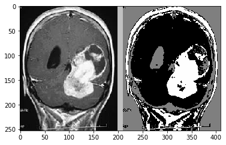
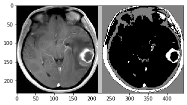
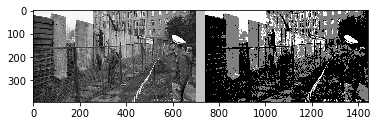

# Image Segmentation
## Abstract:
Image Segmentation is the process by which a digital image is partitioned into various subgroups (of pixels) called Image Objects.
The goal of segmentation is to simplify and/or change the representation of an image into something that is more meaningful and easier to analyze.Image segmentation is typically used to locate objects and boundaries in images. 

## Folder Structure and their Uses:
1.K-Means Clustering :This folder contains a python file that will convert the given images into segmented images with the help of K-Means Clustering Algorithm.The Images used to test this program can be found in the Output Folder. 
2.Application-Image Enhancement and Contrast :This folder contains a python program as well as a jupiter notebook file that will enchance a image by segmentation and also increasing the contrast with the help of the algorithm implemented in the above folder 
3.Output:this file contains the images used for testing the above programs and the results obtained by these programs

## Steps to run the included code:
-K_means Image Segmentation:
  - Command line Arguments:python imageSegmentation.py K inputImageFilename outputImageFilename  (where K is greater than 2.)
-Application Program:
  - Install python and run the .py file with the images to be segemented in the same working directory as of the python file. The output would be stored at the same PWD.
  - you could also install jupyter notebook and take it to the PWD of.ipynb with the images already there following simply with the code execution.

## Algorithm
The K-means algorithm is an iterative technique that is used to partition an image into K clusters.The basic algorithm is 
1.Pick K cluster centers, either randomly or based on some heuristic method. 
2.Assign each pixel in the image to the cluster that minimizes the distance between the pixel and the cluster center 
3.Re-compute the cluster centers by averaging all of the pixels in the cluster 
4.Repeat steps 2 and 3 until convergence is attained (i.e. no pixels change clusters) 
In this case, distance is the squared or absolute difference between a pixel and a cluster center. The difference is typically based on pixel color, intensity, texture, and location, or a weighted combination of these factors.
K can be selected manually, randomly, or by a heuristic. This algorithm is guaranteed to converge, but it may not return the optimal solution. The quality of the solution depends on the initial set of clusters and the value of K.

## Uses of this Program:
- Improved Quality of MRI/Medical images for better detection of diseases and problems
- Segmenting images can help to improve robot vision
- Image segementation can also be applied to satellite images in order to get better object detection

## Results
### 1.Image segmentation by K-Means Clustering Algorithm

### 2.Application Program to Enhance Images

  
  

