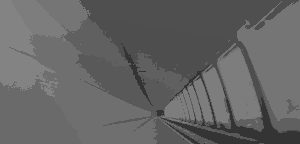

# Image Segmentation
## Abstract:
Image Segmentation is the process by which a digital image is partitioned into various subgroups (of pixels) called Image Objects.
The goal of segmentation is to simplify and/or change the representation of an image into something that is more meaningful and easier to analyze.Image segmentation is typically used to locate objects and boundaries in images. 

## Folder Structure and their Uses:
1.Generic Object Segmentation:This folder contains a python file that will convert the given images into segmented images with the help of K-Means Clustering Algorithm.The Images used to test this program can be found in the Output Folder. 
2.Medical Image Enhancement :This folder contains a python program as well as a jupyter notebook file that will enchance a image by segmentation and also increasing the contrast with the help of the KNN algorithm  
3.Lane Detection:Lane detection plays a key role in the vision-based driver assistance system and is used for vehicle navigation, lateral control, collision prevention, or lane departure warning system. We present an adaptive method for detecting lane marking based on the intensity of road images. 
4.Road Segmentation using Sattelite Images:The src folder contains the source code for the program.The data folder contain link to the images used for training the model and the model folder contains the final model program.The necessary requirement needed to run this program is given in the requirement.txt file  
5.Output:this file contains the images used for testing the above programs and the results obtained by these programs

## Group Members and Their contribution:
- Aaron:Generic Object Segmentation and Medical Image Segmentation
- Pushpak:Lane Segmentation Program
- Pradhi and Aditya:Road Segmentation using Sattelite Images

## Steps to run the included code:
- Generic Object Segmentation:
  - Command line Arguments:python imageSegmentation.py K inputImageFilename outputImageFilename  (where K is greater than 2.)
- Medical Image Enhancement:
  - Install Anaconda and run the jupyter notebook with the images to be segemented in the same working directory as of the notebook and simply follow through with the code execution.
- Lane Segmentation Program:
  - Set the path of the video file of road to be segmented in the main function of the program and execute the program.
- Road Segmentation using Sattelite Images
  - Install jupyter notebook and take it to the PWD of.ipynb with the images already there and simply follow through  with the code execution.You could even aquire our own sattelite images with the aquire_data.py file and run the program after changing the file paths in the program files.
## Algorithm
- Generic Object Segmentation:
The K-means algorithm is an iterative technique that is used to partition an image into K clusters.The basic algorithm is 
1.Pick K cluster centers, either randomly or based on some heuristic method. 
2.Assign each pixel in the image to the cluster that minimizes the distance between the pixel and the cluster center 
3.Re-compute the cluster centers by averaging all of the pixels in the cluster 
4.Repeat steps 2 and 3 until convergence is attained (i.e. no pixels change clusters) 
In this case, distance is the squared or absolute difference between a pixel and a cluster center. The difference is typically based on pixel color, intensity, texture, and location, or a weighted combination of these factors.
K can be selected manually, randomly, or by a heuristic. This algorithm is guaranteed to converge, but it may not return the optimal solution. The quality of the solution depends on the initial set of clusters and the value of K.
- Medical Image Enhancement:Main Algorithm working: 
1.Choosing the number of Clusters(n) 
2.kmeans centers points for centroid. 
3.Assigning each Data point as we say each pixel value closest to the above centroid that further gives us clusters. 
4.in our case 41 was passed as the number of neighbors. 
5.On the last step we just do the concatination of original and segmented image. 
- Lane Segmentation Program:
1.First we start by pre processing the image, which includes converting the input image frame (RGB) to gray scale for reducing the channels.we also remove Image noise for better and accurate edge detection. Then we smoothen the Image. 
2.Identification of edges: We use one of the edge detection techniques called the Canny Technique, which will help us identify the edges in the image. 
3.Determining the region of Interest (ROI ) :  Before we start  detection, we need to decide the particular lane area in the image that we should work-on to write the program. For this we create a ROI function which returns the enclosed region of our field of view, in the case of a road, triangle region would be best fit. We do so by creating a polygon and applying it on a black mask. 
4.Isolation of lanes : Now, we will need to isolate the lanes in the masked portion of the image. We use binaries to isolate. We apply Bitwise AND between the existing image and the gradient image. Doing so will give us perfectly masked out lanes on the road. 
5.Hough Transform : Hough Transform will help us to detect the straight lines in the image and help identifying Lane lines. Hough space is the representation of the b,m axis in the Line equation y=mx+b.  
6.Optimization : We see that the resulting image contains multiple lines having breakpoints in between certain lanes, We can fix this by taking average of their slope and the y intercept to form a single line that will trace a whole lane, thereby optimizing the preview. 
7.Applying the Algorithm to a video frame by frame :  We will use opencv’s VideoCapture function, which will allow us to process the video frame by frame by reading every frame and then applying the algorithm to that particular frame. 
- Road Segmentation using Sattelite Images
To solve the road segmentation problem, we used an Unet, it is a fully convolutional network, with 3 cross-connections. Adam optimiser with a learning rate of 0.00001 was used, along with dice loss (because of the unbalanced nature of the dataset.) The model trained for 61 epochs before earlstopper kicked in and killed the training process. A validation dice loss of 0.7548 was achieved. 
Filename: acquire_data.py 
Function:  Downloads the Massachusetts Roads Dataset or the Massachusetts Buildings Dataset.  
Filename: build_dataset.py 
Function: Crops the images into small 256x256 images and divides the dataset into training and testing set.Splits the dataset into train and test sets and stores then in an ImageDataAugmentation friendly format.  
Filename: get_data_generators.py 
Function: Builds and returns data generators. 
Filename: loss_functions.py 
Function: To deal with the imbalanced data issue 
Filename: Road_Detection_GPU.ipynb (Jupiter Notebook) 
Function: Building the model and executing it to see the predicted output of road segmentation. 

## Uses of Image Segmentation:
- Improved Quality of MRI/Medical images for better detection of diseases and problems
- Segmenting images can help to improve robot vision
- Image segementation is also be applied to satellite images in order to get better object detection. These objects may be buildings,roads,cars,or trees , for example. Applications of this type of imagery labelling are widespread, from analysing traffic to monitoring environmental changes taking place due to global warming.
## Results
### 1.Generic Object Segmentation Program:

{:height="200px" width="100px"}
{:height="200px" width="100px"}

### 2.Medical Image Enhancement Program:

  
  

### 3.Lane Detection Program:

### 4.Satellite Image Segmentation Program:

