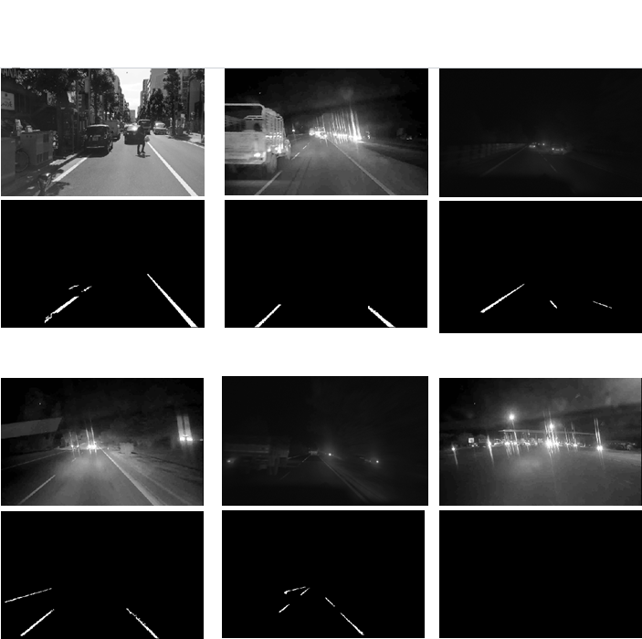

# Image Segmentation
## Abstract:
Image Segmentation is the process by which a digital image is partitioned into various subgroups (of pixels) called Image Objects.
The goal of segmentation is to simplify and/or change the representation of an image into something that is more meaningful and easier to analyze.Image segmentation is typically used to locate objects and boundaries in images. 

## Folder Structure and their Uses:
1.Generic Object Segmentation:This folder contains a python file that will convert the given images into segmented images with the help of K-Means Clustering Algorithm.The Images used to test this program can be found in the Output Folder. 
2.Medical Image Enhancement :This folder contains a python program as well as a jupiter notebook file that will enchance a image by segmentation and also increasing the contrast with the help of the algorithm implemented in the above folder 
3.Lane Detection:Lane detection plays a key role in the vision-based driver assistance system and is used for vehicle navigation, lateral control, collision prevention, or lane departure warning system. We present an adaptive method for detecting lane marking based on the intensity of road images in night scene which is the cause of numerous accidents.
4.Output:this file contains the images used for testing the above programs and the results obtained by these programs

## Group Members and Their contribution:
- Aaron:Generic Object Segmentation and Medical Image Segmentation
- Pushpak:Lane Segmentation Program
- Pradhi and Aditya:Road Segmentation using Sattelite Images

## Steps to run the included code:
- Generic Object Segmentation:
  - Command line Arguments:python imageSegmentation.py K inputImageFilename outputImageFilename  (where K is greater than 2.)
- Medical Image Enhancement:
  - Install python and run the .py file with the images to be segemented in the same working directory as of the python file. The output would be stored at the same PWD.
  - You could also install jupyter notebook and take it to the PWD of.ipynb with the images already there and simply follow through  with the code execution.
- Lane Segmentation Program:
  - Set the path of the video file of road to be segmented in the main function of the program and execute the program.
- Road Segmentation using Sattelite Images
  - Install jupyter notebook and take it to the PWD of.ipynb with the images already there and simply follow through  with the code execution.You could even aquire our own sattelite images with the aquire_data.py file and run the program after changing the file paths in the program files.
## Algorithm
- Generic Object Segmentation & Medical Image Enhancement:
The K-means algorithm is an iterative technique that is used to partition an image into K clusters.The basic algorithm is 
1.Pick K cluster centers, either randomly or based on some heuristic method. 
2.Assign each pixel in the image to the cluster that minimizes the distance between the pixel and the cluster center 
3.Re-compute the cluster centers by averaging all of the pixels in the cluster 
4.Repeat steps 2 and 3 until convergence is attained (i.e. no pixels change clusters) 
In this case, distance is the squared or absolute difference between a pixel and a cluster center. The difference is typically based on pixel color, intensity, texture, and location, or a weighted combination of these factors.
K can be selected manually, randomly, or by a heuristic. This algorithm is guaranteed to converge, but it may not return the optimal solution. The quality of the solution depends on the initial set of clusters and the value of K.
- Lane Segmentation Program:
First, a region of interest (ROI) image is extracted from the original image and
converted to its grayscale image. After that, we segment out regions likely to be lane
using a novel idea based on lane width. Finally, based on the structural and
orientation properties of a lane only those segments are kept which match with these
required properties. Once lane segments are obtained, hough transform can be applied
to estimate lane boundaries. Cognitive methods are then applied to combine results of
previous frame with the current one to avoid any miscalculation.

## Uses of Image Segmentation:
- Improved Quality of MRI/Medical images for better detection of diseases and problems
- Segmenting images can help to improve robot vision
- Image segementation can also be applied to satellite images in order to get better object detection

## Results
### 1.Generic Object Segmentation Program:

### 2.Medical Image Enhancement Program:

  
  

### 3.Lane Detection Program:

### 4.Satellite Image Segmentation Program:

